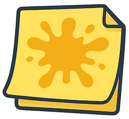
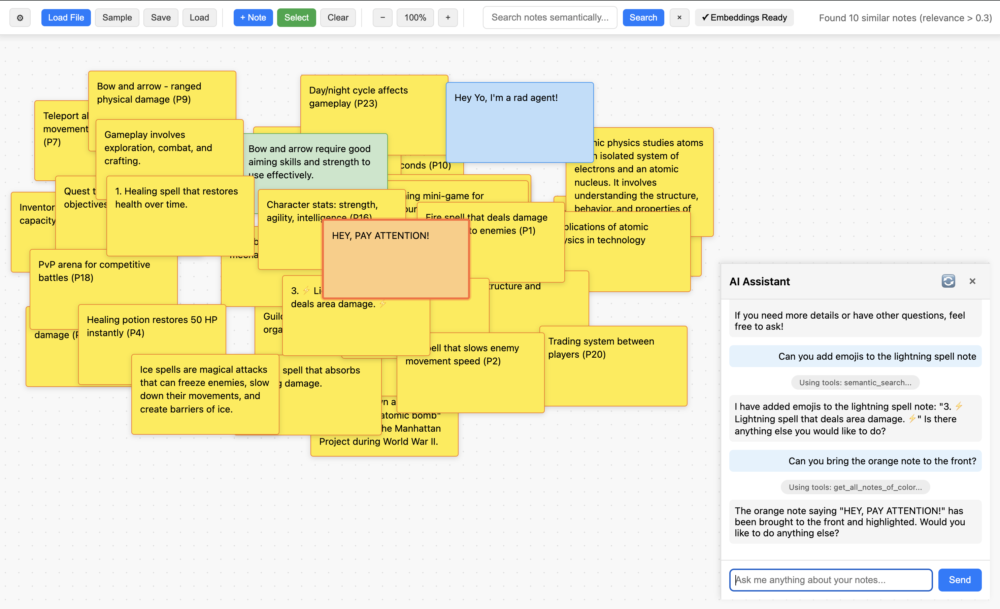
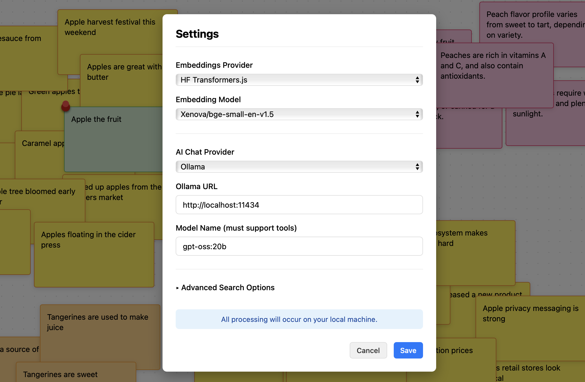

# Splat: An Affinity Diagramming Tool in a Single File

  

**Organize ideas visually. One HTML file. Zero installation.**

An affinity diagramming tool for tasks like qualitative coding and mind-mapping, with a single-file footprint.
 - Cluster notes locally in your web browser
 - Basic tools like select, group move, duplicate, color
 - Save/load board state to/from JSON: dead-easy to transfer to others and edit yourself
 - Semantic search with embedding models by HF Transformers.js (entirely in browser), Ollama, or OpenAI
 - AI Assistant Agent that can perform some basic actions on the notes board (optional, Ollama for local  or OpenAI for more powerful non-local backend)
 - Visualize representativeness of participant IDs (P1, P2, etc.) by selecting notes in a cluster
 - Single HTML file footprint, no dependencies or installation required
 - Completely open-source—feel free to extend and submit PRs to help others!



## How to "install"

Just load `splat.html` in your browser. That's it.

### But what if I want to use semantic search?

Then you will need an internet connection to download an embedding model from HF Transformers.js, which will run locally in your browser. Once it's loaded, though, you're good.

### But what if I'm special and want to call local models from Ollama?

OK, if you want to use [Ollama](https://ollama.com) as an embeddings or LLM provider from your local machine, you *must* enable CORS policy on your running Ollama instance. This is **not** enabled by default. Follow these instructions: https://objectgraph.com/blog/ollama-cors/

For MacOS, what worked for us was running: 

```bash
launchctl setenv OLLAMA_ORIGINS "*"
```

in the terminal, then restarting Ollama and serving it via `ollama serve`. 

To use Ollama, you then must install specific models. Ollama also hosts embedding models, like `bge-large`. For more info, see the [Ollama documentation](https://ollama.com/search).

## Key Features

**Board Interaction**
- **Auto-save**: Work is auto-saved every 60 seconds
- **Zoom & Pan**: Zoom controls (25%-200%) and click-drag panning
- **Drag-and-drop**: Load text files by dragging them directly onto the board
- **Inline Editing**: Double-click any note to edit it directly on the board
- **Pin Notes**: Pin important notes to keep them at the top of the visual stack

**Note Management**
- **Six Colors**: Choose from yellow, pink, blue, green, orange, or purple for visual coding
- **Selection Mode**: Toggle selection mode to drag-select multiple notes
- **Export/Import from JSON**: Simple JSON format to save and load files
- **Participant IDs**: When notes end in participant IDs like (P1) or (P2), participant IDs for all selected notes will appear the status bar (useful when trying to see how 'representative' a cluster is when qualitative coding)

**Semantic Search**
- **Hybrid Retrieval**: Combines BM25 keyword matching with embedding-based semantic similarity
- **Three Embedding Providers**: Choose between Transformers.js (local), Ollama (local), or OpenAI (cloud)
- **Visual Results**: Search results panel shows ranked matches with click-to-focus navigation
- **Configurable**: Adjust BM25 weight, relevance thresholds, and minimum semantic relevance in settings

**AI Assistant (optional)**
- **Tool-Calling Agent**: AI can perform actions like searching, creating, editing, and removing notes (note: it cannot cluster them automatically)
- **Context-Aware**: AI has full access to board state and can use search features
- **Flexible Backend**: Use Ollama for local/private processing or OpenAI for more powerful responses

## Customize semantic search and AI assistant backends

Splat supports semantic search in the browser through HF Transformers.js with `bge-small` by default, which will download the model the first time you compute embeddings. However, you can also configure it to use Ollama or OpenAI embeddings. 

The AI assistant feature can use either Ollama (local) or OpenAI (cloud). 
**The Ollama model you choose must support "tools" to work.** 
For Ollama, I suggest using `gpt-oss:20b`: 



## How To Add Notes from Files?

Splat can load notes from plain text files (`.txt`) or CSV files (`.csv`). To load:
- Drag and drop the file onto the canvas, or
- Click the **Load File** button to browse for the file

### Text Files (.txt)

Each line becomes a separate note on the canvas.

**Example text file format:**
```
Implement user authentication system (P1)
Add dark mode toggle (P2)
Improve load time for large datasets (P1)
Create onboarding tutorial (P3)
Fix navigation menu on mobile (P2)
```

### CSV Files (.csv)

The first column of each row becomes a note. For example, if the CSV is: 

```csv
Implement user authentication system,P1,Security
Add dark mode toggle,P2,UI/UX
Improve load time for large datasets,P1,Performance
Create onboarding tutorial,P3,Documentation
Fix navigation menu on mobile,P2,UI/UX
```

only the first column values will appear as notes. 

The CSV parser handles:
- Quoted fields with commas inside
- Escaped quotes

Notes can include participant IDs in parentheses (e.g., `(P1)`, `(P2)`) at the end. When you select multiple notes, Splat will show all participant IDs in the status bar.

## Why Splat?

I am an [HCI researcher](https://ianarawjo.com) who prefers to [affinity diagram](https://www.nngroup.com/articles/affinity-diagram/) when coding qualitative data. In the past, I've used FigJam and Miro, but find them too clunky and proprietary for this task. 
I wanted a tool that supports affinity diagramming for research with low overhead.

Splat was created during a real research project: an interview study where I had to cluster 1400+ descriptive codes. While using Splat to manually cluster data, I added features iteratively as I needed them. These include selecting multiple notes, displaying participant IDs of selected notes, and  semantic search. When sharing with my teammates, I found it very easy to just give them the exported JSON file and the HTML of Splat, which they could load themselves.

The semantic search feature of Splat is configurable and AI assistance can be entirely local with Ollama running on-device. For many research applications, this privacy is essential. However, I have observed students use Splat for many other use cases, outside of qualitative coding; thus, more powerful AI assistance via OpenAI is available to those who want it. 

## What/Who Is Splat For?

- Mind-mapping and brainstorming
- Qualitative researchers coding interviews and clustering observations
- UX researchers organizing user feedback and research findings
- Product managers clustering feature requests

## Contributing

Splat is offered as a community resource, completely free and open-source. Want a feature? Implement it yourself and raise a Pull Request!

## Acknowledgements

Splat was created by the [Montréal HCI](https://hci.iro.umontreal.ca/) group. The first version of Splat was originally vibe-coded by Ian Arawjo with the help of Claude Sonnet 4.0, and iteratively by myself with further targeted AI help in VS Code.

The AI assistance and search results features were added by Jingyue Zhang, Ling Xin He, and Yunfan Shang. 